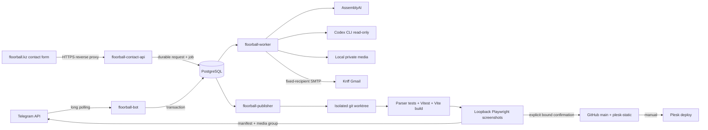

# Архитектура Floorball Content Bot

## Граница системы

Система принимает Telegram updates, авторизует заранее заведённых пользователей, сохраняет входные данные и медиа, формирует версионированные черновики, проводит user/reviewer approval и только затем создаёт детерминированный preview публикации для `floorball.kz`.

Внешние зависимости: Telegram Bot API, AssemblyAI, локальный Codex CLI, PostgreSQL,
SMTP, ffmpeg/ImageMagick/Pillow, локальный clone `floorball.kz` и GitHub. Plesk остаётся
ручным последним шагом.

## Deployment units

- `floorball-bot`: `getUpdates`, durable acceptance, authorization handlers, Telegram replies/outbox dispatch, graceful SIGTERM.
- `floorball-worker`: claims jobs with `FOR UPDATE SKIP LOCKED`, transcribes, extracts structured data, prepares media derivatives and resumes retries.
- `floorball-contact-api`: loopback-only HTTP service; validates the versioned contact contract,
  allowed Origin, body size, honeypot and HMAC pseudonymized IP rate limit, then atomically stores
  the request and delivery job before returning `202 accepted`.
- `floorball-publisher`: advisory lock, approved hash check, isolated worktree, deterministic
  export, tests/build and loopback-only Playwright screenshots; commit/push is a second explicit
  action bound to the persisted screenshot manifest.
- `floorball-backup`: `pg_dump`, media/config manifest and retention; secrets are not copied into reports.

## Persistence and queue

Numbered idempotent SQL migrations manage normalized tables. Jobs have `pending/running/retry/dead/succeeded`, attempts, `available_at`, `locked_at`, `locked_by`, idempotency key and last error. A short transaction atomically claims rows using `FOR UPDATE SKIP LOCKED`. Stale `running` rows return to retry after lease expiry.

Telegram acceptance inserts `processed_updates`, normalized message and any required job/outbox rows in one transaction. `update_id` uniqueness prevents duplicate entities. Outbox delivery is at-least-once with an idempotency key and persisted Telegram message ID; the system promises effectively-once business mutation, not exactly-once networking.

## Request/event flow

1. Poll update with current durable offset.
2. Validate type/size; open DB transaction and insert unique `processed_updates` row.
3. Re-check contact ownership, active user, roles and city scopes for every mutation/callback.
4. Persist message/media metadata; enqueue work and/or response in the same transaction.
5. Advance polling offset only after commit.
6. Worker claims job, calls bounded external provider, stores result/revision and enqueues reply.
7. User confirms transcript and draft. Reviewer separately approves. State machine rejects invalid transitions.
8. Worker periodically projects each city, the federation and approved national/city news into
   public site contracts. A deterministic evaluator records missing blocking fields and notifies
   subscribed, Telegram-bound superadmins only when a new content hash becomes complete.
9. The notification button approves the immutable snapshot and builds an isolated preview. Tests
   and the Vite build run without commit or push. The publisher derives affected routes, starts
   Vite on an allocated `127.0.0.1` port and captures RU/KZ/EN desktop/mobile images with pinned
   locale, timezone, reduced motion and browser revision. Non-loopback browser traffic is blocked.
10. Screenshot rows and one manifest hash bind paths, dimensions, SHA-256 and revision. Telegram
    sends them in durable media groups followed by Approve / Needs changes / Cancel controls.
11. The actor-bound 30-minute approval matching the preview nonce, publication, approved revision
    and screenshot manifest permits one atomic push of `main` and `plesk-static`. Any new revision,
    change request or cancellation invalidates every prior preview artifact and callback.
12. After both remote refs are verified, the bot reports both commit IDs and asks the operator to deploy in Plesk.

Contact requests use a separate flow: the site submits one stable UUID, the loopback API stores
the bounded public fields and a delivery job in one transaction, and the worker sends plain text
to the fixed recipient. Retries preserve the request UUID and deterministic Message-ID; after the
bounded attempts, the row stays `dead` and a Telegram-bound superadmin is notified. SMTP remains
at-least-once across a crash after remote acceptance and before the local `sent` commit.

New-city applications are another isolated flow. `/start new_city` stores a short-lived intent
before any identity binding. A verified self-contact creates `city_applicant`, not `users`; answers
never enter editor conversations or agent context. An explicit superadmin decision is followed by
a dry-run/apply initializer which locks and reserves the slug, creates an inactive city, then grants
the newly created user only `city_coach` and one city scope.

## Interfaces

- Configuration: environment only; `.env` is accepted for local development. Canonical secret names are `TG_API_KEY` and the user-provided `ASSEMBLI_AI`; alias `ASSEMBLYAI_API_KEY` is supported.
- Telegram callbacks contain opaque server-side action ID plus nonce, never role/city authority.
- Free-form messages such as «добро» cannot publish. Only the one-use confirmation button tied to
  the exact actor, publication, revision and screenshot manifest can authorize commit/push.
- Extractor input is untrusted text inside a delimited JSON envelope. Output must satisfy a Pydantic-generated JSON Schema; one validation repair is permitted.
- Public export uses explicit Pydantic allowlist models, never DB-row serialization.
- News bodies use typed paragraph/heading/quote blocks. The client renders block text through
  React nodes and never executes stored markup as HTML.

## Codex subprocess boundary

The wrapper invokes `codex exec --ephemeral --sandbox read-only --ignore-user-config --output-schema ... --output-last-message ...` with an argv list, a secret-free allowlisted environment, isolated cwd, one-process semaphore, timeout and stdout/stderr caps. Process group receives TERM then KILL. User text never becomes a shell command.

The official OpenAI non-interactive-mode documentation confirms that `codex exec` is intended for scripts, supports `--ephemeral`, and defaults to read-only; local `codex exec --help` confirms the exact flags installed here.

## Failure handling and observability

- Retry only timeout, connection, 429 and provider 5xx errors using bounded exponential backoff plus jitter.
- Auth, schema, consent, invalid transition and permanent Telegram errors go directly to review/dead state.
- JSON structured logs include correlation/update/job/publication IDs, never full phone/token/transcript/private paths.
- Health command checks DB, polling heartbeat, disk, dead jobs, latest backup and publication.
- The contact API binds only `127.0.0.1`; the existing HTTPS reverse proxy exposes only
  `/api/contact`. Its `/healthz` checks PostgreSQL readiness and is not public by design.

## Resource model

One Codex subprocess globally, one transcription job by default, small asyncpg pool, no Redis/Kafka/Kubernetes/local LLM. Originals remain outside Git; bounded public derivatives are copied only into an isolated publication worktree.
