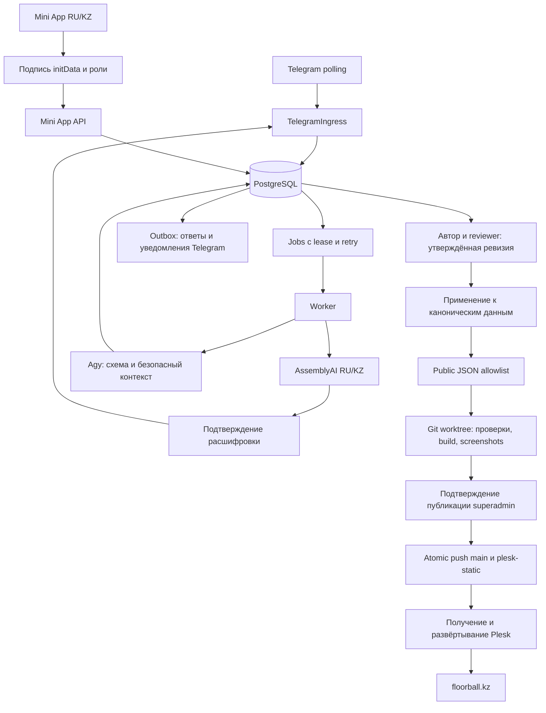

# Аудит production — 30 сентября 2026

> Этот документ фиксирует исходный аудит. Актуальные изменения и состояние
> выпуска: [PRODUCTION_RELEASE_2026-09-30.md](PRODUCTION_RELEASE_2026-09-30.md).
> Оба ID уже активированы; первоначальные ограничения ниже описывают состояние до исправлений.

## Исходный вывод

Уточнение пользователя после аудита: все новые данные собирает бот. Google Forms,
Sheets и Apps Script не являются целевыми каналами сбора и не требуются для
готовности бота. Добавление реальных пользователей и развёртывание сайта отложены
до завершения настройки и проверки самого бота.

Бот, worker, Mini App и постоянный HTTPS-туннель установлены и работают на сервере.
Их автозапуск включён. Можно заранее создавать пользователей по Telegram ID и
назначать роли. Обнаруженные ошибки приёма updates, подтверждения голоса,
конкурирующих правок и применения анкет федерации исправлены.

**Полный сбор и публикация всего контента ещё не завершены:**
часть собираемых сведений не имеет полного пути до публичной страницы.
Развёртывание сайта и настройка отдельной формы связи — последующие этапы;
Google Forms исключён из обязательных настроек.
Ниже разделены проверенная работа, ограничения кода и необходимые внешние настройки.

Дата указана по Asia/Almaty. Проверки выполнялись 29 сентября вечером UTC —
30 сентября ночью по времени сервера и пользователя.

## Цель и стратегия изменений

Проверить реальный сервер `/home/moses/tg_bot_floorball_site`, сайт
`/home/moses/floorball.kz`, Telegram, PostgreSQL и Mini App. Готовность означает
работающий сбор контента, сохранение при сбоях, контроль ролей, проверяемую
публикацию и автоматическое восстановление процессов после перезапуска.

Текущий путь: Telegram polling → транзакция PostgreSQL → jobs → worker →
утверждённый черновик → каноническая БД → public JSON → изолированный Git
worktree → тесты/сборка/screenshots → второе подтверждение → atomic Git push →
развёртывание Plesk. Mini App использует ту же БД и подписанный Telegram initData.

Подтверждённые исходные проблемы:

- Menu button указывает на несуществующий в DNS Cloudflare Quick Tunnel.
- При ошибке сохранения update polling всё равно увеличивает Telegram offset.
- Worker умеет проецировать trainer/news, но не strategy/history/leadership.
- Миграция 021 допускает Telegram ID без телефона, CLI этого не поддерживает.
- Полная проверка: 168 passed, 2 failed; Ruff: 8 ошибок.
- Mini App audit: 1 critical, 1 high, 3 moderate в dev dependencies.
- SMTP/contact API не настроены; публичный contact endpoint возвращает HTML.

Изменения ограничиваются этими путями. Публичные JSON-контракты v1 сохраняются.
Новая миграция 022 добавляет журнал применения анкет федерации; существующие
таблицы, ревизии и очереди не удаляются. Телефонный onboarding сохраняется.
Для Mini App используется уже доступный стабильный Tailscale Funnel; изменения
не затрагивают другие маршруты этого сервера.

Проверки: весь pytest на отдельной `_test` БД, Ruff, compileall, pip check;
тесты/lint/build/audit Mini App и сайта; реальный preview без push;
read-only Telegram API и подписанный bootstrap; restart сервисов и health;
проверка backup/restore. Секреты и личные контакты в отчёт не включаются.

Использованы навыки backend-flow-tracer, senior-backend-architect-mode,
implementation-strategy, code-change-verification, playwright и pr-draft-summary.
Актуальные внешние контракты проверялись через Context7 и официальную документацию.

Дополнительная обнаруженная ошибка: exporter контактов/портретов проверяет наличие
любого старого `granted`, поэтому более поздний `withdrawn` не закрывает доступ.
Минимальная коррекция — использовать последнюю запись согласия для каждого
subject/scope; импортированный публичный bundle сохраняет совместимость только
при отсутствии явного согласия/отзыва. Проверка — PostgreSQL roundtrip с grant,
withdraw и повторным grant для клуба, игрока и руководителя.

Проверка актуальной документации AssemblyAI через Context7 и официальные страницы
выявила несовместимость: batch-запрос закреплял `universal-3-pro`, который не
поддерживает RU и заменён в API. Для существующего RU batch-пути закрепляется
поддерживаемый `universal-2`; ответ/публичные схемы не меняются. Проверки:
перехват request body в native unit test и короткие синтетические RU/KZ записи
через реальные providers. Модель Whisper для KZ проверяется отдельно.

Подтверждение голоса ограничивается текущей анкетой. Порядок выбирается по времени
готовности расшифровки (приватный timestamp в provider_metadata), чтобы поздний retry
не подтверждал другое сообщение. Совместимость старых записей сохраняется через
fallback created_at. Проверка — Telegram/PostgreSQL с другой paused-анкетой и
расшифровками, завершившимися не в порядке отправки.

## 1. Фактическое размещение

| Компонент | Где находится | Назначение |
|---|---|---|
| Python backend | `/home/moses/tg_bot_floorball_site/src/floorball_bot` | Telegram, API, редакционный процесс, jobs, публикация |
| PostgreSQL | `floorball_bot` на домашнем сервере | Канонические записи, сессии, роли, очереди, аудит |
| Mini App frontend | `miniapp/`, production `miniapp/dist` | Кабинет RU/KZ, анкеты, прогресс и доступ |
| Website checkout | `/home/moses/floorball.kz` | Отдельный React/Vite сайт и публичные JSON-контракты |
| Website production | Plesk, `floorball.kz`, `/httpdocs` | Статическая сборка, отдельная от backend |
| Private files | `var/media` | Голос, оригиналы медиа и документов; не web root |
| Preview builds | `var/worktrees`, отдельные artifact directories | Изолированные сборки, manifest, screenshots |
| Backup | `var/backups` | PostgreSQL custom dump и архив media |
| HTTPS Mini App | `https://moses-cv.tail55e85c.ts.net/floorball-miniapp/` | Постоянный Tailscale Funnel на `127.0.0.1:8092` |

Бот работает через long polling. Входящий HTTPS ему не нужен. Mini App требует
публичный HTTPS. Домашний сервер и Plesk — разные машины: локальный адрес на
Plesk не направляет запросы в домашний backend.

Redis, отдельный брокер сообщений и второй источник анкет здесь не используются.
Telegram и Mini App работают с общими PostgreSQL-сессиями и conversation_memory.
Публичный сайт читает сборку с встроенными JSON, а не эту БД в реальном времени.

## 2. Архитектура и границы ответственности



| Модуль | Ответственность |
|---|---|
| `telegram.py` | Приём updates, onboarding, команды, меню, review callbacks, подтверждение голоса |
| `auth.py` | Активность actor, роли, city scopes, привязка собственного контакта/известного Telegram ID |
| `dialogue/` и определения анкет | Версии спецификаций, типы полей, обязательность, проверка gaps и patch |
| `context_gateway.py` | Контекст для AI с проверкой роли/города и ограничением доступных сведений |
| `miniapp_api.py` | Telegram HMAC auth, bootstrap, старт/возобновление и правки полей |
| `worker.py`, `queue.py` | Обработка заданий, leases, retry/dead, извлечение, медиа, проекции |
| `providers/agy.py` | Изолированный CLI, ограниченный input/output, строгая JSON Schema, repair |
| `providers/transcription.py` | RU batch и KZ Whisper streaming, ffmpeg, таймауты |
| `projection/` | Применение только утверждённой ревизии; согласия, city scope, идемпотентность |
| `exporters.py` | Только поля публичных моделей; исключение private contacts/evidence/raw input |
| `publisher.py` | Изолированная сборка, allowlist файлов, nonce, hashes, screenshot manifest, Git refs |
| `health.py`, systemd и scripts | Heartbeats, dead queues, backup, watchdog, автоматический restart |

## 3. Как синхронизируются чат и Mini App

1. Actor определяется по подписанному Telegram ID, а доступ — по БД, не по frontend.
2. Оба интерфейса открывают одну pinned conversation_session и conversation_memory.
3. При переключении режима текущая анкета ставится на паузу. Возврат возобновляет
   сохранённую сессию с той же спецификацией, без потери заполнения.
4. Mini App передаёт revision и уникальный request_id. Повтор одной правки
   идемпотентен; устаревшая revision возвращает `409`.
5. AI получает снимок памяти. Перед сохранением worker повторно блокирует память
   и сравнивает revision/содержимое. Если пользователь успел изменить форму,
   старый ответ AI не затирает эту правку; задание повторяется с новым контекстом.
6. Расшифровка относится к конкретному message_id. Без подтверждения она не
   превращается в извлечённые поля анкеты. Подтверждение относится к текущей сессии.

Реальный HTTP-тест проверяет `401` без подписи, `403` для неизвестного пользователя,
успешный bootstrap/start/patch, повтор patch, `409` и сохранение прогресса при
переключении режима. PostgreSQL-тест моделирует гонку Mini App и AI.

## 4. Матрица контента: что доходит до сайта

| Сведения | Сбор/хранение | Публичный путь и ограничения |
|---|---|---|
| Город: описание, история, статистика | Trainer questionnaire | Подтверждённая анкета → city projection → city JSON → preview/publish |
| Клубы, группы, расписание | Trainer questionnaire | Реализована нормализация и экспорт; контакты требуют отдельного разрешения |
| Миссия, видение, ценности, цели | Strategy questionnaire | Теперь реализована federation projection; исходный язык RU/KZ, другой язык сохраняется |
| История, достижения, roadmap | History questionnaire | Теперь реализована federation projection; факты должны иметь источник |
| Руководство: имя, роль, биография, focus | Leadership questionnaire | Теперь реализована federation projection; контакты приватны без явного разрешения |
| Новые портреты руководства | Поля предусмотрены | Новый portrait/portrait_url блокируется до отдельного модерируемого media flow |
| Новости RU/KZ/EN | News questionnaire, сообщения, переводы/правки | Есть news projection, approved media, public JSON и копирование news assets |
| Фото/галерея города из новой анкеты | Сведения можно собрать | Trainer projection оставляет предупреждение `media.require_moderation_projection`; полного автоматического применения нет |
| Новые публичные профили игроков | Сведения можно собрать | Trainer projection оставляет `players.require_separate_consent_projection`; самостоятельной полноценной анкеты player нет |
| Старые city heroes, gallery, player profiles | Импортированный публичный bundle | Существующий импорт/экспорт проверен roundtrip; это не подтверждает путь новых upload |
| Официальные документы | Приватные PDF, метаданные, checksums, сроки, напоминания | Закрытый реестр; флаг согласия не публикует PDF. Отдельный публичный publisher документов не реализован |
| Заявка на новый город | Deep link, собственный контакт, анкета и решение superadmin | Dry-run/apply и резервирование slug; первоначальная публичная карточка не заменяет заполненный городской контент |
| Форма связи сайта | HTTP API, durable request, SMTP job | Код и тесты есть; реальный contact API/SMTP/HTTPS relay сейчас не настроены |
| Старая регистрация на турнир | Website → Google Apps Script | Остаток прежней архитектуры. У бота нет отдельного сценария регистрации на турнир; настройка Apps Script не является решением для целевой схемы |

Наличие карточки «Игрок» или «Медиа» в разделе доступа Mini App не доказывает,
что для неё реализован полный процесс создания и публикации контента.
Поле анкеты, запись в БД и публичная проекция — разные стадии.

Federation v1 содержит RU/KZ. Английская оболочка сайта использует свои fallback.
Проекция не сочиняет переводы. Для values/goals и roadmap языковые варианты
сопоставляются по проверенному порядку: reviewer должен сверять соответствие
элементов при изменении списка. Исторические записи связываются по источнику и
периоду. Несколько входящих событий с одинаковой парой источник/период блокируются
как неоднозначные, чтобы одно событие не заменяло другое молча.
Автоматическое удаление пропущенных в анкете федерации записей не предусмотрено.

## 5. Публикация и фактическая версия сайта

Утверждение текста ещё не публикует страницу. Exporter формирует полный публичный
bundle выбранного типа. GitPublisher фиксирует ревизию, получает актуальный main
и plesk-static, создаёт detached worktree и разрешает менять только content JSON,
поддержанные assets и dist. Затем выполняет три контрактных Node-проверки, тесты
сайта, build и screenshots затронутых маршрутов на RU/KZ/EN и desktop/mobile.

Superadmin подтверждает конкретный preview с nonce, сроком 30 минут и hashes.
При изменении ревизии, manifest или удалённых refs подтверждение блокируется.
Проверяется целостность самих PNG. Push двух Git refs атомарный; повторные сбои
разбираются через reconciliation. Force push и переписывание истории не нужны.

**Оставшийся внешний шаг — Plesk.** Карточка `floorball-build.git` должна брать
`plesk-static` в `/httpdocs`. Карточка исходников main в `/app-src` не обновляет сайт.
Автоматическое развёртывание Plesk из бота сейчас не доказано/не настроено.

Проверено фактическое расхождение:

- Website main: `ad1c3e761119f45e705d90195623a970e000748d`.
- Static branch: `f889598c79b4a71c961feea4ad1b8f06e92f0cc2`.
- В подготовленной static ветке index ссылается на `index-Mh11Aqaj.js`.
- Публичный `https://floorball.kz` ссылается на `index-DagAeh_Q.js`.

Нужны получение/развёртывание текущего static commit в Plesk, проверка отсутствия
старого HTML-кэша и проверка asset hash на публичном сайте. Доступ к Plesk через
Chrome получен; результаты прямой проверки перечислены ниже. Тестовый preview
не был отправлен в Git и не изменил публичный контент.

### Проверка Plesk через Chrome 30 сентября 2026

- Подтверждены обе карточки: `floorball.kz.git`, `main → /app-src`;
  `floorball-build.git`, `plesk-static → /httpdocs`. В обеих включён режим
  автоматического развёртывания уже полученных Plesk коммитов.
- Карточка static всё ещё показывает последний commit от 2 сентября; main —
  от 21 сентября. `git ls-remote` повторно подтвердил удалённые refs выше.
- Корень веб-хостинга — `httpdocs`; SSL включён, выбран Let's Encrypt для
  floorball.kz, HTTP → HTTPS 301 уже включён. nginx proxy cache отключён.
- В настройках static существует URL webhook. Его значение не записывалось
  в отчёт. Наличие URL не доказывает, что соответствующий GitHub webhook создан
  и доставляет события: Chrome не авторизован в GitHub, настройки repository
  hooks пока недоступны. Открыта вкладка входа с возвратом к этим настройкам.
- Plesk показывает 33 резервные копии сайта (1.71 ГБ); свежая клиентская
  инкрементная копия — 29 сентября 10:25, серверная полная — 29 сентября 03:13.
  Это backup сайта на хостинге, а не внешняя копия БД/media домашнего bot-сервера.
- В уже подготовленной static `.htaccess` всё ещё есть четыре redirect
  `/forms/{trainer,strategy,history,leadership}` на Google Forms. При переходе
  на сбор данных только ботом эти legacy routes также требуют замены.
- Сохранённые настройки Plesk, роли и публичный сайт в этой проверке не менялись.
  Получение static при включённом auto-deploy немедленно обновило бы сайт;
  из-за прежнего указания отложить deployment запрошено уточнение пользователя.

## 6. Роли и добавление людей

| Роль | Назначение |
|---|---|
| `superadmin` | Администрирование, review, подтверждение публикации, все города |
| `reviewer` | Проверка и утверждение контента; не окончательный publish |
| `federation_editor` | Анкеты федерации и официальный реестр документов |
| `city_coach` | Работа с назначенными городами; нужен city scope |
| `coach_form` | Заполнение trainer questionnaire без прав редактирования сайта/publish |
| `media_editor` | Роль для операций с медиа; не заменяет отсутствующий end-to-end upload flow |
| `player` | Роль есть в модели доступа; полноценного player questionnaire/publisher нет |

Подготовка по известному Telegram ID:

```bash
cd /home/moses/tg_bot_floorball_site
.venv/bin/floorball-bot create-user --telegram-id TELEGRAM_ID --name 'Имя'
# Команда печатает UUID. Подставить его ниже:
.venv/bin/floorball-bot grant-role --user UUID --role federation_editor
# Для city_coach также назначить город:
.venv/bin/floorball-bot scope-city --user UUID --city CITY_UUID
```

После назначения активный пользователь открывает бот и выполняет `/start`.
Телефон для заранее разрешённого Telegram ID не обязателен. Старый вариант
`create-user --phone ...` и проверка собственного контакта сохранены.
Автоматическая регистрация по `?start=coach` выдаёт только `coach_form`.
Неизвестный Telegram ID не получает привилегии. CLI не активирует отключённый
аккаунт молча. Повторное grant-role/scope-city восстанавливает отозванное назначение.

Фактический исходный список: 5 пользователей, 4 активных, 2 привязанных Telegram ID.
Всем добавлять superadmin не требуется. Нужен список «Telegram ID — имя — роль — город»;
новые реальные пользователи без такого списка в production не создавались.

Повторная проверка production БД 30 сентября:

| Telegram ID | Роль | Состояние | City scopes |
|---|---|---|---|
| `5527988733` | `superadmin` | Активен | Нет; superadmin имеет доступ ко всем городам |
| `191148810` | `superadmin` | Отключён (`active=false`, не удалён) | Нет |

Таким образом, привязанных ID два, но действующий доступ есть у одного. Причина
отключения второго не установлена; он не активировался в ходе проверки.

## 7. Исправления

1. Устаревший Cloudflare Quick Tunnel заменён постоянным существующим Funnel.
   Menu URL Telegram проверен через API и совпадает с конфигурацией.
2. Telegram offset не сдвигается при незафиксированном DB-сбое. Постоянный сбой
   должен быть записан как failed update; его наличие теперь ухудшает health.
3. Добавлены projection strategy/history/leadership и миграция 022 журнала применения.
   Только текущая утверждённая ревизия, pinned definition/context/hash, транзакция,
   блокировка и idempotency; чужой язык/неизменяемые разделы сохраняются.
4. Добавлены Telegram-ID provisioning и восстановление отозванных ролей.
   Исправлен неработавший SQL conflict target команды scope-city.
5. Голос связан с message_id, требует подтверждения, корректно выбирается при
   retry и не перехватывает ответ другой анкеты.
6. AI не затирает одновременную правку Mini App. Переключение анкеты сохраняет сессию.
7. Последнее согласие/отзыв определяет экспорт контакта/портрета, включая ранее
   импортированные записи. Старый grant больше не перекрывает новый withdrawal.
8. RU batch переключён с неподходящей/заменённой модели на поддерживаемую universal-2.
9. Обновлены Vite/Vitest Mini App, peer dependency и lockfile; audit теперь 0.
10. Исправлены Ruff ошибки, сломанный import в тесте TelegramRetryAfter и устаревшее
    ожидание сообщения о Plesk; добавлены проверки реальных пограничных сценариев.

## 8. Проверки и доказательства

| Проверка | Результат / граница |
|---|---|
| Исходный полный pytest | 168 passed, 2 failed; исправлены обе причины |
| Полный pytest установленного итогового кода на отдельной `_test` БД | 184 passed за 15.57 секунд; 2 нефатальных aiohttp NotAppKeyWarning |
| Отдельные regression checks | 8 provider tests, 21 Telegram/integration tests, 11 federation tests; реальные RU/KZ запросы успешны |
| Ruff | Все src/tests и tunnel script проходят |
| Python environment | pip check и compileall проходят |
| Mini App | Чистый npm ci, lint, 2 tests, build; npm audit 0 vulnerabilities |
| Website | 3 Node contract checks; 38 tests в 11 files; lint и build проходят |
| Website dependencies | High/critical audit gate проходит; остаётся 1 moderate undici advisory |
| Настоящий publisher preview | Успешно; 18 PNG: `/`, `/clubs`, `/clubs/almaty` × 3 языка × 2 viewport |
| Git safety preview | main remote не изменился; publication в test DB отменена, worktree удалён; PNG сохранены |
| Agy настоящий schema call | Синтетический city patch валиден, 58 секунд |
| Agy настоящий pinned dialogue | Strategy patch, 121 секунда; mode/spec/context pins совпали; извлечены source_language и mission |
| AssemblyAI RU | Синтетический русский голос обработан universal-2, 7 секунд |
| AssemblyAI KZ | Синтетический казахский голос обработан whisper-rt, 14 секунд, paced PCM |
| Public Mini App API | Signed bootstrap 200; без подписи 401; frontend 200; healthz 200 |
| Браузер Mini App | Кабинет и доступ загрузились через публичный URL; mobile 390×844 без horizontal overflow |
| Native Telegram client | Ручной запуск на телефоне реальным новым пользователем ещё не проверен |
| Backup/restore | Восстановлены backup до установки (21 миграция) и итоговый backup (22 миграции) в `floorball_bot_restore_test`; SHA-256 manifest итогового набора проверен |
| Deployment | Production миграция 022 применена; четыре units active/enabled, Linger=yes |

В браузерном тесте Telegram WebApp SDK заменён контролируемым объектом с настоящим
подписанным initData существующего actor. Backend и публичный туннель настоящие;
этот тест не заменяет проверку нативного Telegram на телефоне. UI-навигация была
read-only. Screenshot доступа: локально `output/playwright/miniapp-access-mobile.png`.

Снимки preview визуально проверены для главной RU/mobile, города RU/mobile и
клубов KZ/desktop. Создание всех 18 снимков не означает ручной проверки каждого
пикселя всех страниц. Термин «Vix Design» не удалось связать с конкретным сервисом
или компонентом: требуется точное название/ссылка. Проверен существующий UI сайта
и Mini App; отдельная неизвестная интеграция не сертифицирована.

Синтетическая речь распознана с неточностями в спортивных терминах. В production
текст надо подтверждать/исправлять. Тесты не обещают идеальную точность любого аудио
или постоянную доступность внешних providers.

Воспроизводимые команды (только отдельная `_test` БД):

```bash
cd /home/moses/tg_bot_floorball_site
.venv/bin/ruff check src tests scripts/run_tunnel.py
PATH=/home/moses/.local/bin:/usr/bin:/bin \
  TEST_POSTGRES_DSN='postgresql:///floorball_bot_test?host=/var/run/postgresql' \
  PUBLISH_ENABLED=false .venv/bin/pytest -q -m 'not external' --tb=short
.venv/bin/python -m pip check
.venv/bin/python -m compileall -q src scripts
cd miniapp
npm ci
npm run lint
npm test
npm run build
npm audit --audit-level=high
```

Mini App npm-команды проверены в отдельном audit checkout с тем же lockfile и
скопированной в production сборкой. Они не выполнялись поверх работающих процессов.
Website команды: три `node scripts/test-*.mjs` contract checks из build_preview,
`npm --prefix app test`, `npm --prefix app run lint`, `npm --prefix app run build`.

## 9. Автозапуск, восстановление и эксплуатация

Активны и включены `floorball-content-bot`, `floorball-content-worker`,
`floorball-content-miniapp`, `floorball-content-tunnel`. `Restart=always`, user
linger включён. PostgreSQL и tailscaled включены как системные службы.
Backup, health и watchdog timers включены и показывают очередной запуск.
Funnel `--bg` сохраняет маршрут в tailscaled; wrapper восстанавливает выделенный
путь и проверяет health. Остальные маршруты `/` и `/tenders-miniapp` сохранены.

Выполнен контролируемый stop/start четырёх служб и дополнительный restart worker
после voice model исправления. Полная перезагрузка машины не выполнялась:
проверены необходимые on-boot настройки, а не фактическое отключение питания.
При отсутствии сети после загрузки процессы повторяют попытки через systemd/
provider retries. Уже принятые jobs/outbox остаются в PostgreSQL.

`After=postgresql.service` в user unit не задаёт порядок относительно системного
PostgreSQL. Реальное восстановление здесь опирается на включённый системный
PostgreSQL и повторный запуск приложения, если БД ещё не готова.

Health после установки: database ok, dead jobs/outbox 0, failed updates 0,
polling/worker heartbeat свежие, backup свежий, диск примерно 42%. Нет ни одной
реальной published job; зелёный health не доказывает выполненный deploy сайта.

Перед установкой сохранены прежний tracked code, `.env`, Mini App dist и tunnel unit:
`/home/moses/tg_bot_floorball_site/var/deploy-backups/20260929T210653Z`.
Миграция 022 добавляет таблицу, не удаляет существующие данные; старый код может
игнорировать эту таблицу при откате. `.env` не входит в patch или Git.

Backup сейчас хранится на том же сервере. Внешняя копия и восстановление всей
машины/media/config на другом устройстве не проверены. PostgreSQL restore drill
не является доказательством восстановления при потере единственного SSD.
Итоговый dump: `var/backups/daily/database-20260929T212818Z.dump`.
Регулярный backup содержит БД и media, но не `.env`; секретная конфигурация
отдельно сохранена перед установкой в защищённом deploy-backup.

## 10. Что остаётся до полного публичного запуска

| Приоритет | Условие | Что требуется |
|---|---|---|
| Следующий этап | Публичная сборка отстаёт | Доступ Plesk уже получен. После готовности бота: deployment static ветки, сверка hashes/routes; для проверки GitHub webhook нужен вход с правами на repository settings |
| Отдельный website flow | Форма связи не работает end-to-end | При сохранении этой формы: SMTP credentials, CONTACT_API_SECRET, отдельный HTTPS contact route, build VITE_CONTACT_API_URL и проверка доставки |
| Legacy website flow | Старая регистрация турниров через Google Forms | Устранить устаревший канал при обновлении сайта; новые данные должны собираться ботом. Google webhook настраивать не требуется |
| P1 для обещания «весь контент» | Новые city media, player profiles, leader portraits, public documents | Отдельные завершённые consent/moderation/projection/publisher workflows; текущие границы перечислены выше |
| Следующий этап | Реальные пользователи не заведены списком | Пользователь предоставит Telegram ID, имя, роль и city scopes позже; затем `/start` и native Mini App smoke |
| P2 | Контент пуст | Анкеты RU/KZ с проверенными сведениями, источниками и review |
| P2 | Backup одного устройства | Внешнее хранилище и полный restore drill |
| P2 | Термин Vix Design не определён | Точное название/ссылка, чтобы проверить требуемый компонент |

В канонической БД и текущих исходных bundles содержимое совпадает, но это
преимущественно пустые карточки: 7 городов без описаний/историй, проверенной
статистики/клубов; mission/history/leadership пусты; news items 0.
Публичная контентная готовность ложная для всех городов и федерации.
Обязательных официальных документов 7, загруженных актуальных 0.
Система может собирать данные; она не должна подставлять вымышленные факты ради
зелёной readiness.

## 11. Состояние изменений для review

Исходный bot HEAD `311435f`. Изменения находятся в локальной ветке
`codex/production-readiness-2026-09-30` и установлены в рабочем checkout сервера.
Они не закоммичены и не отправлены в remote; PR не создавался. Состояние сервера
нужно учитывать перед следующим git pull/reset: установленный patch следует
сначала сохранить/закоммитить. Website source и static branches этим аудитом
не менялись. Тестовая publication существует только в `_test` БД.

### Использованные первичные источники

- [Tailscale Funnel CLI](https://tailscale.com/docs/reference/tailscale-cli/funnel):
  persistence `--bg` после restart/reboot.
- [AssemblyAI model selection](https://www.assemblyai.com/docs/pre-recorded-audio/select-the-speech-model):
  явный выбор моделей и fallback universal-2.
- [AssemblyAI текущие модели](https://www.assemblyai.com/docs/getting-started/models):
  поддерживаемые языки и поколение Universal-3.5 Pro.
- [AssemblyAI официальный integration guide](https://github.com/AssemblyAI/assemblyai-skill/blob/main/skills/assemblyai/SKILL.md):
  переход моделей в сентябре 2026 и legacy whisper-rt.
